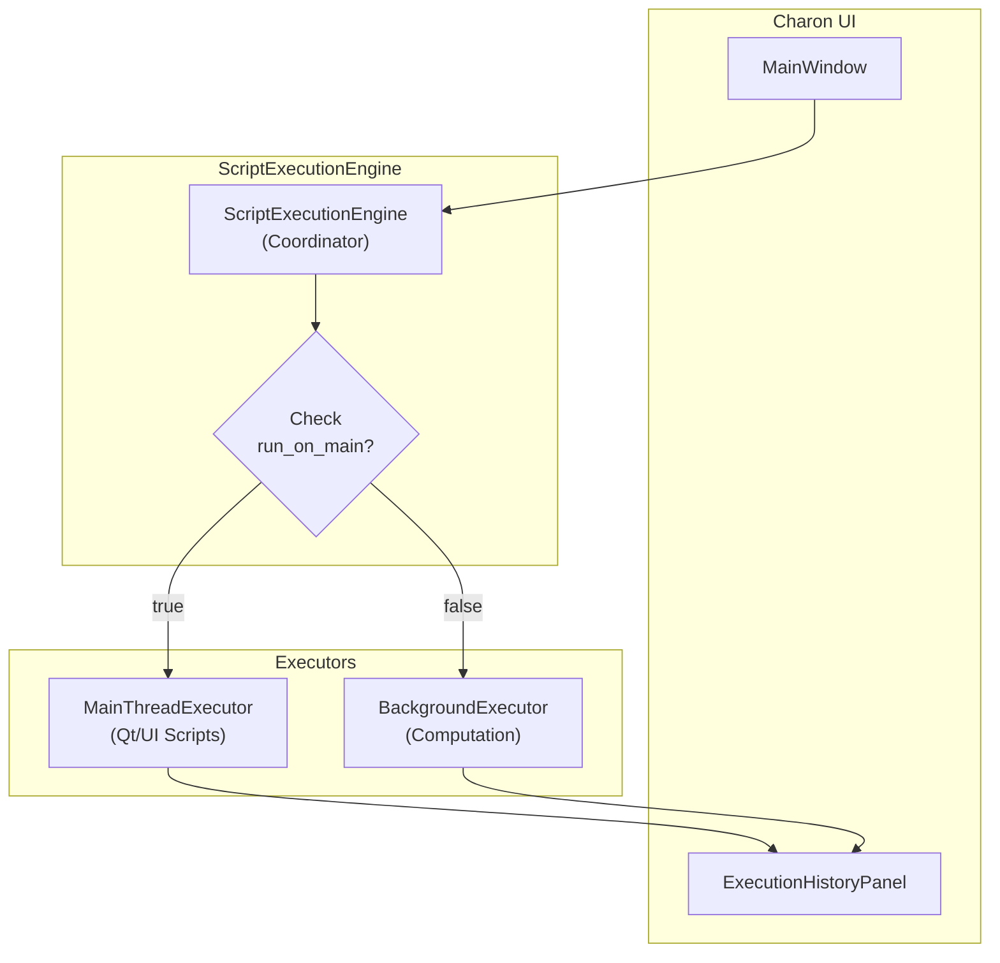

# Charon Script Execution Engine Architecture

This document details the design and architecture of Charon's dual-mode script execution engine.

## Overview

The engine provides a clean, dual-mode execution system that replaces the complex Qt thread patching approach with a simple, reliable solution based on script metadata.

## Core Architecture

### Dual Execution Modes

1. **Main Thread Executor** (`MainThreadExecutor`)
   - For Qt/UI scripts that create widgets
   - Executes on the main GUI thread
   - Scripts declare this via `"run_on_main": true` in `.charon.json`

2. **Background Executor** (`BackgroundExecutor`)
   - For pure computation scripts
   - Executes in worker threads
   - Default mode for better performance
   - Cannot create Qt widgets

### Execution Flow



## Qt Threading Considerations

### The Problem
User scripts often contain Qt code that creates widgets, dialogs, or calls `QApplication()`. Qt widgets MUST be created and manipulated on the main GUI thread. When these scripts run in worker threads:

1. **Windows**: Raises clear exceptions (e.g., "wrapped C/C++ object has been deleted")
2. **Maya**: Can freeze the entire application due to tight Qt integration
3. **Nuke**: Similar threading violations but different error handling

### The Solution
The dual-mode execution model eliminates these issues:

1. **Metadata Declaration**: Scripts specify execution requirements
   ```json
   {
       "run_on_main": true,
       "software": ["Windows", "Maya"],
       "entry": "main.py"
   }
   ```

2. **Automatic Routing**: Engine checks metadata and routes to appropriate executor

3. **Clear Error Messages**: Background executor detects Qt usage and provides helpful guidance

### Qt Detection in Background Threads

The `BackgroundExecutor` implements multiple layers of protection:

```python
# Layer 1: Static code analysis
if 'PySide2' in code or 'PyQt' in code:
    print(QT_WARNING_MESSAGE)

# Layer 2: Error pattern detection
qt_error_indicators = [
    "QWidget", "QApplication", "thread", 
    "main thread", "QPainter", "wrapped C/C++ object"
]

# Layer 3: Helpful error formatting
if _is_qt_threading_error(error):
    return f"""
    Qt Threading Error: This script contains Qt widget code that cannot run in background threads.
    SOLUTION: Update your script's .charon.json file:
    {
        "run_on_main": true,
        ...
    }
    """
```

## Thread-Safe Output Capture

Both executors implement thread-safe output capture:

### Main Thread Executor
- Uses `OutputCapture` context manager
- Temporarily redirects `sys.stdout/stderr`
- Restores original streams after execution

### Background Executor
- Uses thread-local stdout proxy
- Each thread gets isolated output stream
- No interference between concurrent scripts

## Execution Management

### Unique Execution IDs
Every execution gets a UUID for tracking:
- Manages concurrent executions
- Routes output to correct UI elements
- Enables cancellation of specific scripts

### Thread Pool Management
Background executor limits concurrent threads:
```python
MAX_BACKGROUND_THREADS = 4  # Prevent resource exhaustion
```

### Signal Communication
All executors use Qt signals for thread-safe communication:
- `execution_started(id, path)`
- `output_updated(id, text)`
- `execution_completed(id, result)`
- `execution_failed(id, error)`

## Script Namespace

Both executors provide consistent namespace:
```python
script_namespace = {
    '__name__': '__main__',
    '__file__': entry_file,
    '__script_path__': script_path,
    '__host__': host,
    '__execution_mode__': 'main' or 'background'
}
```

## Thread Compatibility System

### Overview
The execution engine includes a centralized thread compatibility checker that ensures scripts run in the appropriate execution mode, even when users select otherwise. This prevents crashes and provides clear feedback about why certain scripts must run on the main thread.

### How It Works

The thread compatibility check is performed **only when the user requests background execution**. This avoids unnecessary checks and ensures override messages only appear when actually overriding user preferences.

```python
def _determine_execution_mode(self, script_path: str, force_background: bool, 
                             force_main_thread: bool, entry_file: str = None) -> bool:
    # 1. Check what the user wants
    user_wants_main = metadata.get("run_on_main", True) if not force_background else False
    
    # 2. If user already wants main thread, no compatibility check needed
    if user_wants_main and not force_background:
        return True
    
    # 3. User wants background - check if that's safe
    can_run_in_background, reason = self._check_thread_compatibility(...)
    
    # 4. Override if necessary and store reason for user notification
    if not can_run_in_background:
        self._thread_override_reason = reason
        return True  # Force to main thread
```

### The `_check_thread_compatibility` Method
Located in `ScriptExecutionEngine`, this method centralizes all thread compatibility rules:

```python
def _check_thread_compatibility(self, script_path: str, entry_file: str, 
                               metadata: Dict[str, Any]) -> Tuple[bool, Optional[str]]:
    """
    Returns: (can_run_in_background, reason_if_not)
    """
```

### Current Compatibility Rules

1. **MEL Scripts** (Maya only)
   - Always forced to main thread
   - Reason: "MEL scripts are not thread-safe and must run on main thread"
   - Detection: Checks both `script_type == "mel"` and `.mel` file extension

2. **Qt/GUI Scripts** (All hosts)
   - Forced to main thread when Qt imports detected
   - Reason: "Script imports {library} - Qt widgets require main thread"
   - Detection: Scans file content for imports: `PySide2`, `PyQt5`, `PyQt6`, `PySide6`, `QtWidgets`, `QtCore`, `QtGui`

### Adding New Thread Compatibility Rules

To add a new special case that requires main thread execution:

1. **Open** `execution/engine.py` and find the `_check_thread_compatibility` method (~line 210)

2. **Add your rule** following this pattern:

```python
# Rule N: [Description of what requires main thread]
if [your_condition]:
    return (False, "[User-friendly explanation why main thread is required]")
```

3. **Example implementations**:

```python
# Rule 3: MaxScript must run on main thread in 3ds Max
if script_type == "maxscript" and self.host.lower() == "3dsmax":
    return (False, "MaxScript must run on main thread in 3ds Max")

# Rule 4: Scripts using OpenGL require main thread
if entry_file and os.path.exists(entry_file):
    with open(entry_file, 'r', encoding='utf-8') as f:
        content = f.read()
        if 'OpenGL' in content or 'GL.glBegin' in content:
            return (False, "OpenGL operations require main thread")

# Rule 5: Blender Python API requires main thread
if self.host.lower() == "blender" and script_type == "python":
    with open(entry_file, 'r', encoding='utf-8') as f:
        if 'bpy' in f.read():
            return (False, "Blender Python API requires main thread")
```

4. **Key principles**:
   - Check conditions in order of likelihood/performance (metadata first, file content last)
   - Provide clear, user-friendly reasons that explain WHY main thread is needed
   - The reason string will be shown to users as: "Note: {your reason}"
   - Return `(True, None)` if the script CAN run in background
   - Return `(False, "reason")` if it MUST run on main thread

5. **Testing your rule**:
   - Create a test script that matches your condition
   - Set `"run_on_main": false` in its `.charon.json`
   - Run the script and verify:
     - Terminal shows: "Note: {your reason}"
     - Script executes successfully on main thread
     - All output appears in execution dialog

### User Experience

When a script is forced to main thread despite user selection:
1. A notification appears in the terminal/console only
2. Example: "Note: Script imports PySide2 - Qt widgets require main thread"
3. The execution dialog shows only the script's actual output
4. The message only appears when actually overriding user's background execution request

Users retain control via the "Run on main thread" checkbox:
- Default: Checked (safe default)
- Can uncheck for pure computation scripts
- System overrides only when necessary for stability

### Output Capture Differences

#### Python Scripts
- Full output capture support using custom `captured_print` function
- Qt event handler output is captured via Python closures
- All print statements appear in execution dialog
- See `documentation/08-qt-output-capture.md` for implementation details

#### MEL Scripts  
- Basic output capture via stdout/stderr redirection
- Some MEL output may go directly to Maya's Script Editor
- Error messages should be captured, but not all print output
- This is an intrinsic limitation of Maya's MEL output system
- MEL's `print` command doesn't always route through Python's stdout

### Output Capture Behavior

When a script is redirected from background to main thread:

1. **Terminal output**: Shows the override reason message
2. **Execution dialog**: Shows ONLY the script's actual output (no override message)
3. **Execution behavior**: Identical to running with `"run_on_main": true`

This ensures consistent behavior regardless of how the script ends up on the main thread.

## Error Handling

### Graceful Failures
- Scripts that fail don't crash Charon
- Clear error messages with tracebacks
- Special handling for Qt threading errors

### Host-Specific Considerations
- **Maya**: Extra protection against freezing
- **Windows**: Standard exception handling
- **Nuke**: Compatible error reporting

## Best Practices

### For Script Authors
1. **UI Scripts**: Always set `"run_on_main": true`
2. **MEL Scripts**: Automatically run on main thread (MEL is not thread-safe)
3. **Computation**: Use default background mode
4. **Mixed Scripts**: Separate UI and computation logic

### For Developers
1. Check metadata before execution
2. Use appropriate executor based on requirements
3. Never create Qt widgets in background threads
4. Test across all target hosts

